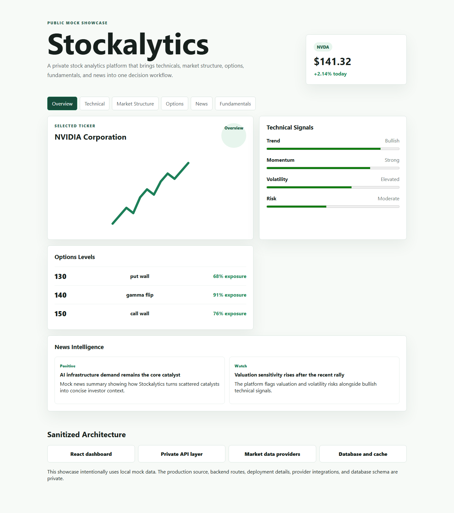

# Stockalytics Showcase

Stockalytics is a private stock analytics platform that I am building to explore market data, technical signals, market structure, options metrics, fundamentals, and news context in one dashboard.

> This is a public showcase repository. The production source code is private because the real project is actively developed and connected to a deployed backend, database, workers, and market-data provider integrations.

## What This Repository Contains

- A small mock React/Vite app that demonstrates the product workflow
- Local mock data only
- A sanitized architecture overview
- No production backend code, deployment scripts, provider clients, database migrations, secrets, or live URLs

## Screenshot



## Key Features Represented

- Dashboard and ticker analysis concept
- Technical signal summary
- Market structure workflow
- Options level visualization concept
- News intelligence summaries
- Fundamentals and risk framing

## Tech Stack Represented

- React
- TypeScript
- Vite
- CSS modules-style plain CSS
- Mock analytical data

## Sanitized Architecture

```text
React dashboard
      |
      v
Private API layer
      |
      v
Market data / news / analysis providers
      |
      v
Database and cache layer
```

Production domains, routes, queue details, database schema, worker logic, and provider integrations are intentionally omitted.

## Run Locally

```bash
npm install
npm run dev
```

Build check:

```bash
npm run build
```

## Security Note

The full Stockalytics source remains private because it is connected to a live backend and contains implementation details that should not be exposed in a public portfolio repository. I can discuss selected architecture and implementation tradeoffs in interviews.

## What I Learned

- Designing a data-heavy dashboard around a clear analysis workflow
- Separating frontend presentation from backend data orchestration
- Thinking about public portfolio safety before exposing source code
- Communicating complex financial tooling without revealing production internals
